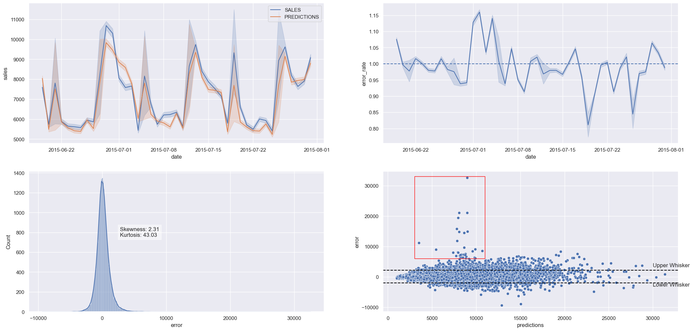

# Readme
# Previsão de Vendas - Rede de Farmácias Rossmann

A Rossmann é uma rede de farmácias que opera em mais de 3.000 lojas em 7 países europeus, empregando cerca de 56 mil colaboradores. A empresa disponibilizou dados de vendas de suas filiais na plataforma [Kaggle](https://www.kaggle.com/competitions/rossmann-store-sales/overview), contendo mais de 1 milhão de registros com 18 características únicas para cada venda.

# 1. Problema de Negócio
O Chief Financial Officer (CFO) da Rossmann deseja reformar as lojas da rede de farmácias, visando melhorar a estrutura e o atendimento ao público. Para isso, ele informou aos gerentes que precisa receber a previsão de receita das próximas 6 semanas de cada loja, a fim de determinar o valor a ser investido em cada uma delas.

# 2. Descrição dos Dados
| Atributo                          | Descrição                                                                                                                                             |
| :-------------------------------- | :---------------------------------------------------------------------------------------------------------------------------------------------------- |
| Store                             | Identificador único de cada loja                                                                                                                      |
| Date                              | Data em que ocorreu o evento de venda                                                                                                                 |
| DayOfWeek                         | Variável numérica que representa o dia da semana                                                                                                      |
| Sales                             | Valor de vendas do dia                                                                                                                                |
| Customers                         | Quantidade de clientes na loja no dia                                                                                                                 |
| Open                              | Indicador para loja aberta = 1 ou fechada = 0                                                                                                         |
| StateHoliday                      | Indica se o dia é feriado de estado. a = Feriado público, b = Feriado de páscoa, c = Natal, 0 = Não há feriado                                        |
| SchoolHoliday                     | Indica se a loja foi ou não fechada durante o feriado escolar                                                                                         |
| StoreType                         | Indica o modelo de lojas. Pode variar entre a, b, c, d                                                                                                |
| Assortment                        | Indica o nível de variedade de produtos: a = básico, b = extra, c = estendido                                                                         |
| CompetitionDistance               | Distância (em metros) para o competidor mais próximo                                                                                                  |
| CompetitionOpenSince [Month/Year] | Indica o ano e mês em que o competidor mais próximo abriu                                                                                             |
| Promo                             | Indica se a loja está com alguma promoção ativa no dia                                                                                                |
| Promo2                            | Indica se a loja deu continuidade na promoção: 0 = loja não está participando, 1 = loja participando                                                  |
| Promo2Since [Year/Week]           | Descreve o ano e semana de quando a loja começa a a promoção extendida                                                                                |
| PromoInterval                     | Descreve os meses em que a loja iniciou a promo2, ex.: "Feb,May,Aug,Nov" significa que a loja iniciou as promoções estendidas em cada um desses meses |

# 3. Estratégia da Solução
Para garantir uma entrega rápida e eficiente da primeira solução, com o objetivo de trazer valor para a empresa e permitir decisões ágeis por parte do CFO, foi adotado o método CRISP-DS.

O método CRISP-DS é composto por 9 etapas cíclicas, em que a cada iteração dessas etapas, o resultado de negócio é aprimorado, buscando entregas cada vez mais rápidas e de maior qualidade, com maior precisão. Isso possibilita que as equipes que utilizarão os resultados desenvolvidos tenham um produto minimamente utilizável já na primeira entrega, e que seja aprimorado ao longo do tempo.

## Passos do CRISP-DS:
1. **Problema de Negócio:** Esta etapa tem como objtive receber o problema de negócio que será resolvido. É nesta etapa que é recebido a pergutna ou o pedido feito pelo dono do problema, que no caso deste projeto, é o CFO da rede Rossmann.

2. **Entendimento de Negócio:** Esta etapa tem como objetivo entender a dor do dono do problema e qual a sua real necessidade. Nesta etapa podem surgir protótipos da solução para validar com o dono do problema o que ele deseja como solução. 

3. **Coleta de Dados:** Esta etapa tem como objetivo realizar a coleta dos dados, buscando eles nas tabelas do(s) banco(s) de dados da empresa. 

4. **Limpeza dos Dados:** Esta etapa tem como objetivo remover toda e qualquer sujeira nos dados. Um dado sujo pode ser entendido como um dado que irá atrapalhar a performance final do algoritmo de Machine Learning. Tomando o cuidado entender bem o fenômeno que está sendo estudado para que não sejam removidos dados importantes para a modelagem do problema.

5. **Exploração dos Dados:** Esta etapa tem como objetivo entender os dados e como eles se relacionam entre si. Normalmente, são criadas hipóteses acionáveis de negócio que são posteriormente validadas utilizando técnicas de análise de dados. Além da criação de novas *features* que serão utilizadas na etapa de Modelagem de Dados.

6. **Modelagem dos Dados:** Esta etapa tem como objetivo preparar os dados para que eles sejam utilizados pelos algoritmos de Machine Learning. É nesta etapa que são feitos as transformações e *encodign* dos dados, a fim de facilitar o aprendizado do algoritmo utilizado.

7. **Aplicação de Algoritmos de Machine Learning:** Esta etapa tem como objetivo selecionar e aplicar algoritmos de Machine Learning nos dados preparados nas etapas anteriores. É nesta etapa que são selecionados os algoritmos e feito a comparação de performance enetre eles, para selecionar o algoritmos que melhor performou como algoritmo final.

8. **Avaliação de Performance:** Esta etapa tem como objetivo verificar a performance do algoritmo selecionado na etapa anterior com os resultados atuais, ou *base line* atual. Neste momento é feito a tradução da performance do algoritmo para perfomance de negócio. Ou seja, quanto a solução criada tratrá de retorno financeiro para a empresa. Caso a performance seja aceitável, o algoritmo é publicado e é retornado para a etapa de entendimento de negócio novamente, a fim entender melhor possíveis lacunas e assim melhorar a performance do algoritmo selecionado. Caso a performance não seja aceitável, o algoritmo não é publicado e é retornado para a etapa de entendimento de negócio para fazer uma nova iteração e assim melhorar a performance da solução.

9. **Publicação da Solução:** Esta etapa tem como objetivo publicar o algoritmo selecionado, deixando publico e utilizável a solução criada.

## 3.1. Produto Final
Foi acordado com o CFO a disponibilização de uma API que será utilizada para retornar as previsões das lojas. Essa API irá utilizar o modelo de Machine Learning desenvolvido para realizar a previsão.

## 3.2. Ferramentas Utilizadas
Para criar a solução, foram utilizadas as seguintes ferramentas:
- Linguagem de Programação Python versão 3.9
- Versionador de código Git
- Aplicação Jupyter Notebook para prototipar a solução
- Serviço de Hospedagem em Nuvem
- Técnicas de manipulação de dados utilizando a linguagem de programação Python
- Técnicas de redução de dimensionalidade e seleção de atributos
- Algoritmos de Machine Learning da biblioteca [scikit-learn](https://scikit-learn.org/stable/) da linguagem de programação Python
- Flask para criação da API

# 4. Modelos de Machine Learning
No primeiro ciclo do projeto, foram selecionados cinco algoritmos para teste, visando identificar o algoritmo com melhor desempenho e custo de implementação. Nessa etapa inicial, optou-se pela simplicidade, considerando que era o primeiro ciclo do projeto e o objetivo principal era entregar uma solução mínima utilizável para a equipe de negócios e pelo CFO.

Os algotitmos selecionados foram:
- Avarege Model
- Linear Regression
- Linear Regression - Lasso
- Random Forest Regressor
- XGBRegressor

Após a seleção dos algoritmos, procedemos com o treinamento e teste de cada um deles para avaliar sua performance. Além disso, utilizamos o método de seleção de features Boruta para identificar as variáveis mais relevantes e impactantes na base de dados. 

# 5. Seleção do Modelo de Machine Learning
## 5.1. Escolha da Métrica
Na escolha entre os algoritmos, utilizamos a métrica ***MAPE (Mean Absolute Percentage Error)***, que é uma medida de erro que expressa a porcentagem média do erro em relação ao valor real. Optei por essa métrica porque ela é mais compreensível para a equipe de negócios e o CEO, uma vez que fornece uma representação percentual do erro em relação ao valor médio. Dessa forma, é mais fácil interpretar e comunicar o desempenho dos algoritmos selecionados.

## 5.2. Métricas dos Algoritmos - *Time Series Cross-Validation*

Com esse método de validação, foram obtidas as seguintes performances:

| Nome do Modelo                |        MAE CV         |   MAPE CV     |       RMSE CV      |
| :-----------------------------|----------------------:|--------------:|-------------------:|
|XGBoost Regressor	            |   1039.3 +/- 180.86	| 0.14 +/- 0.02	|1503.36 +/- 257.42  |
|Random Forest Regressor	    |   909.86 +/- 300.85	| 0.13 +/- 0.03	|1361.46 +/- 453.59  |
|Linear Regression - Lasso	    |   2118.87 +/- 345.32	| 0.29 +/- 0.01	|3062.75 +/- 509.44  |
|Linear Regression	            |   2083.79 +/- 299.26	| 0.30 +/- 0.02	|2955.12 +/- 472.79  |

## 5.3. Escolha do Modelo
Embora o algoritmo ***Random Fores Regressor*** tenha sido o algoritmo que melhor performou, foi optado pelo algoritmo ***XGBosst Regressor*** nesta etapa. 
- Primeiro, porque o erro entre esses dois algoritmos é pequeno.
- segundo porque o tempo de treinamento do ***XGBoost Regressor*** é mais rápido se comparado ao algoritmo ***Random Fores Regressor***. 
- Terceiro porque o modelo final treinado pelo algoritmo ***XGBoost Regressor*** ocupa menos espaço que o algoritmo ***Random Fores Regressor***, deixando assim o uso de servidores em nuvem mais baratos.
- E por último nossa prototipagem não seria viável devido ao espaço reduzido na plataforma render para alocar o  modelo.

## 5.4. Ajuste de Hiperparâmetros
Foi empregada a técnica de ***Random Search*** para otimizar a busca dos melhores hiperparâmetros. 

### 5.5 Métricas do Modelo Final

| Nome do Modelo                |             MAE    |       MAPE    |            RMSE    |
| :---------------------------- | -----------------: | ------------: | -----------------: |
| XGB Regressor Tuned           | 659.89             | 0.1           |	960.92            |

# 6 Performance

## 6.1 Performance do modelo

Ao analisar os dois primeiros gráficos abaixo, é evidente que o modelo é capaz de capturar o comportamento cíclico das vendas, embora apresente alguns períodos com taxas de erro mais elevadas.

Já nos dois últimos gráficos, a distribuição das previsões parece seguir uma distribuição normal. No entanto, é notável que tanto a kurtosis (43.03) quanto a Skewness (2.31) apresentam valores elevados. Além disso, ao examinarmos o quarto gráfico, onde estão plotados os erros, podemos observar que muitas previsões estão fora dos limites, indicado por uma linha tracejada, e também podemos identificar valores extremos destacados em vermelho.

Uma análise mais aprofundada revela que esses erros outliers ocorrem em lojas específicas, o que pode ser uma área de investigação para um ciclo de análise subsequente. 

# 7. Conclusões

Neste estágio do projeto, podemos tirar algumas conclusões importantes. É evidente que o modelo não apresenta um desempenho uniforme para todas as lojas. Nesse sentido, sugiro ao CFO que priorize um levantamento das 700 lojas que demonstraram bom desempenho até o momento.

Para o próximo passo, nossa recomendação é que concentremos nossa análise nas demais lojas. Isso nos permitirá alcançar resultados mais adequados para prever as vendas das próximas 6 semanas. A partir dessas informações sólidas, o CFO poderá tomar decisões embasadas para elaborar os orçamentos.

Essa abordagem direcionada nos permitirá otimizar nossos recursos e concentrar nossos esforços onde têm maior probabilidade de impacto positivo.

# 8. Próximos Passos

* Realizar uma investigação detalhada para identificar as causas das previsões inadequadas em algumas lojas.
* Explorar a inclusão de diferentes algoritmos durante a próxima fase de treinamento, com o objetivo de aprimorar a precisão das previsões.
* Identificar e criar novas variáveis (features) que possam contribuir para melhorar o desempenho do modelo atual e futuros modelos de previsão.
* Criar novas *Features* para tentar melhorar a perfomance do modelo atual e de modelos futuros.
* Fazer novos levantamentos de hipóteses afim de buscar novos insights e conhecimento de negócio.